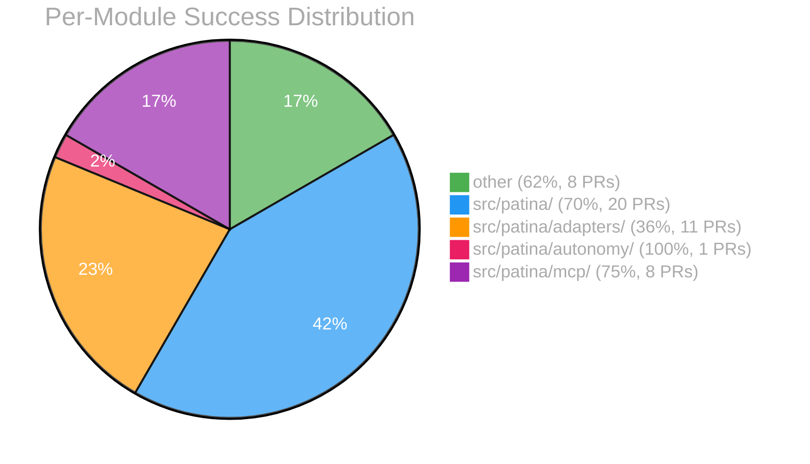

# EVAL Report

## Overall

| Metric | Value |
|--------|-------|
| First-attempt success | 80% |
| Avg cost/PR | $0.77 |
| Human edit rate | 6% |

## Per-Module Breakdown

| Module | Success | Avg Cost | PRs | Auto-merge ready? |
|--------|---------|----------|-----|--------------------|
| other | 62% | $1.09 | 8 | No |
| src/patina/ | 70% | $1.28 | 20 | No |
| src/patina/adapters/ | 36% | $0.38 | 11 | No |
| src/patina/autonomy/ | 100% | $1.91 | 1 | No |
| src/patina/mcp/ | 75% | $0.47 | 8 | No |

## Trend

| Date (UTC) | Implementations | First-attempt | Avg Cost | Human Edits |
|------|----------------|---------------|----------|-------------|
| 2026-09-19 | 64 | 80% | $0.77 | 6% |

```mermaid
xychart-beta
    title "First-Attempt Success Rate (UTC)"
    x-axis ["2026-09-19"]
    y-axis "Success %" 0 --> 100
    line [80]
```

```mermaid
xychart-beta
    title "Avg Cost/PR (UTC)"
    x-axis ["2026-09-19"]
    y-axis "Cost ($)"
    line [0.77]
```


