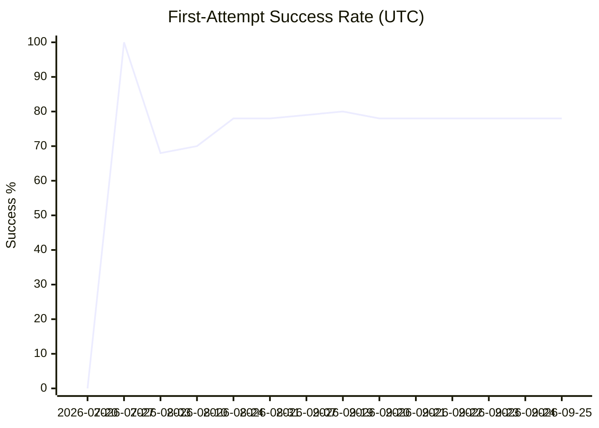
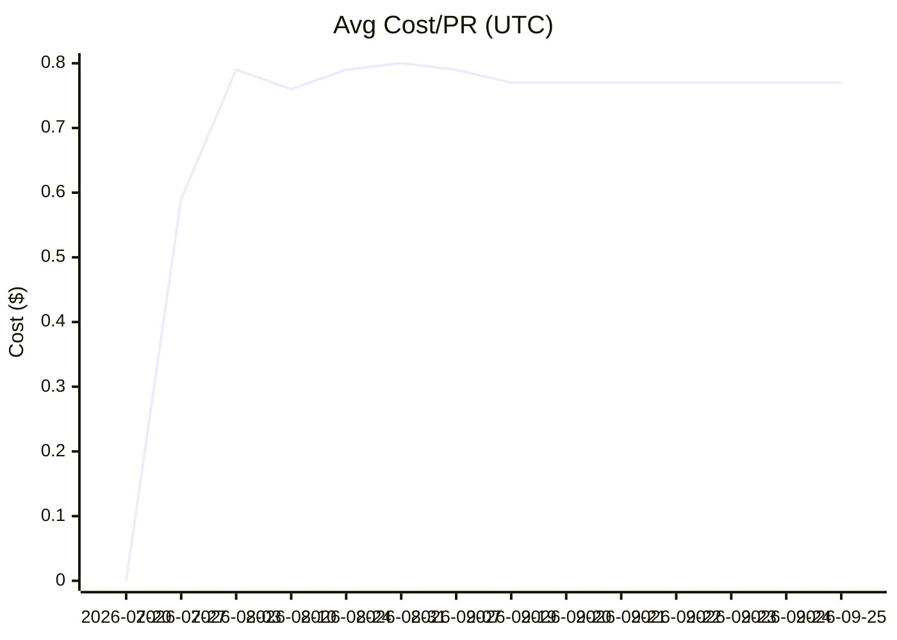
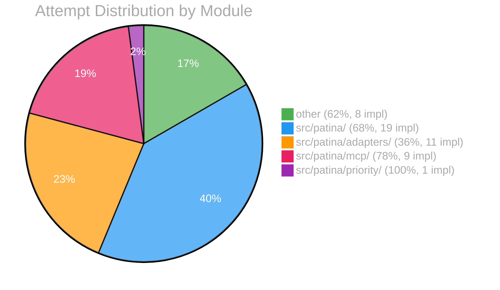

# EVAL Report

## Overall

| Metric | Value |
|--------|-------|
| First-attempt success | 78% |
| Avg cost/PR | $0.77 |
| Human edit rate | 10% |

## Auto-Merge Gate (repo-level)

| Metric | Value | Threshold |
|--------|-------|-----------|
| Success rate | 78% | >90% |
| Edit rate | 10% | <5% |
| Clean merges | 43 | ≥10 |
| **Ready?** | **No** | |

## Per-Module Breakdown

| Module | Success | Avg Cost | Impl | Auto-merge ready? |
|--------|---------|----------|------|--------------------|
| other | 62% | $1.09 | 8 | No |
| src/patina/ | 68% | $1.30 | 19 | No |
| src/patina/adapters/ | 36% | $0.38 | 11 | No |
| src/patina/mcp/ | 78% | $0.51 | 9 | No |
| src/patina/priority/ | 100% | $1.91 | 1 | No |

## Trend

| Date (UTC) | Implementations | First-attempt | Avg Cost | Human Edits |
|------|----------------|---------------|----------|-------------|
| 2026-07-20 | 14 | 0% | $0.00 | 0% |
| 2026-07-27 | 1 | 100% | $0.59 | 0% |
| 2026-08-03 | 14 | 68% | $0.79 | 10% |
| 2026-08-10 | 1 | 70% | $0.76 | 13% |
| 2026-08-24 | 9 | 78% | $0.79 | 10% |
| 2026-08-31 | 6 | 78% | $0.80 | 9% |
| 2026-09-07 | 2 | 79% | $0.79 | 11% |
| 2026-09-19 | 1 | 80% | $0.77 | 10% |
| 2026-09-20 | 0 | 78% | $0.77 | 10% |
| 2026-09-21 | 0 | 78% | $0.77 | 10% |
| 2026-09-22 | 0 | 78% | $0.77 | 10% |
| 2026-09-23 | 0 | 78% | $0.77 | 10% |
| 2026-09-24 | 0 | 78% | $0.77 | 10% |
| 2026-09-25 | 0 | 78% | $0.77 | 10% |

