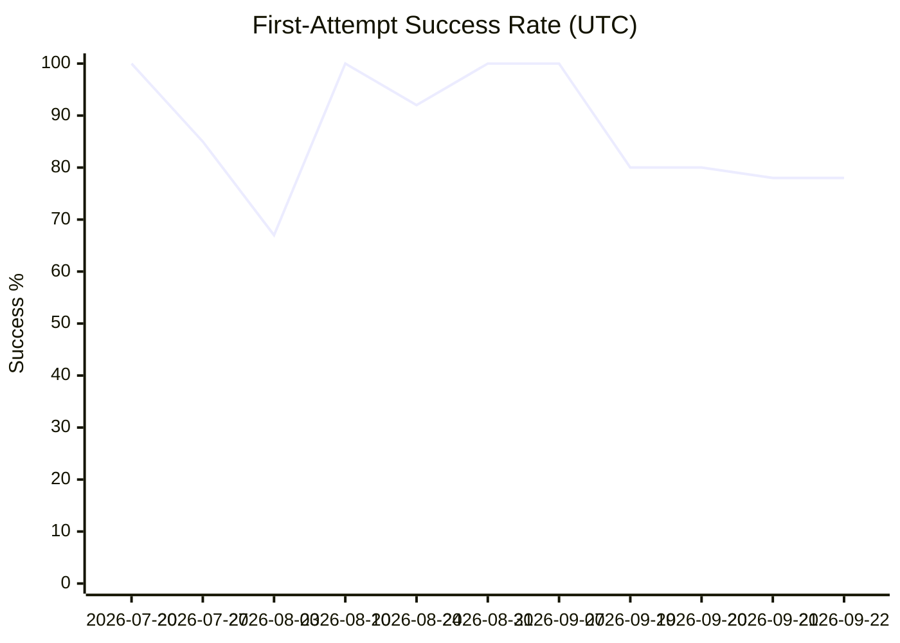
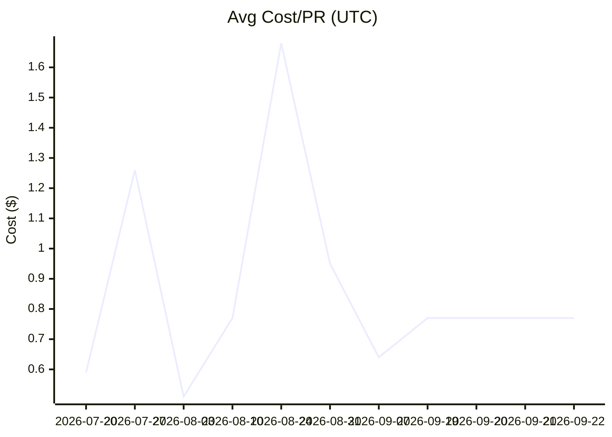
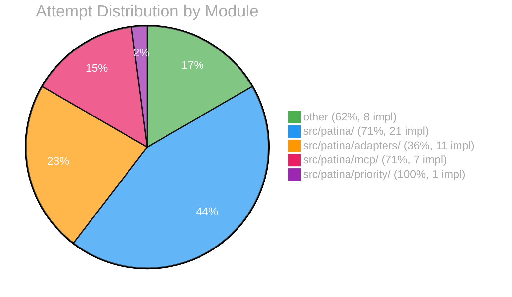

# EVAL Report

## Overall

| Metric | Value |
|--------|-------|
| First-attempt success | 78% |
| Avg cost/PR | $0.77 |
| Human edit rate | 10% |

## Per-Module Breakdown

| Module | Success | Avg Cost | Impl | Auto-merge ready? |
|--------|---------|----------|------|--------------------|
| other | 62% | $1.09 | 8 | No |
| src/patina/ | 71% | $1.25 | 21 | No |
| src/patina/adapters/ | 36% | $0.38 | 11 | No |
| src/patina/mcp/ | 71% | $0.43 | 7 | No |
| src/patina/priority/ | 100% | $1.91 | 1 | No |

## Trend

| Date (UTC) | Implementations | First-attempt | Avg Cost | Human Edits |
|------|----------------|---------------|----------|-------------|
| 2026-07-20 | 1 | 100% | $0.59 | 0% |
| 2026-07-27 | 13 | 85% | $1.26 | 0% |
| 2026-08-03 | 3 | 67% | $0.51 | 0% |
| 2026-08-10 | 2 | 100% | $0.77 | 0% |
| 2026-08-24 | 13 | 92% | $1.68 | 0% |
| 2026-08-31 | 2 | 100% | $0.95 | 0% |
| 2026-09-07 | 1 | 100% | $0.64 | 0% |
| 2026-09-19 | 64 | 80% | $0.77 | 6% |
| 2026-09-20 | 64 | 80% | $0.77 | 10% |
| 2026-09-21 | 65 | 78% | $0.77 | 10% |
| 2026-09-22 | 65 | 78% | $0.77 | 10% |

