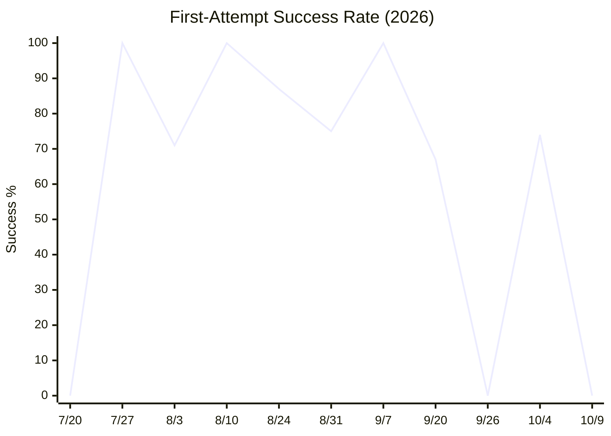
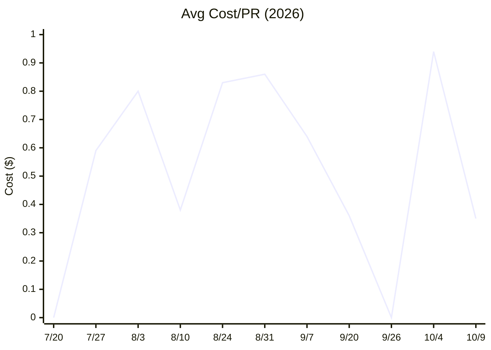
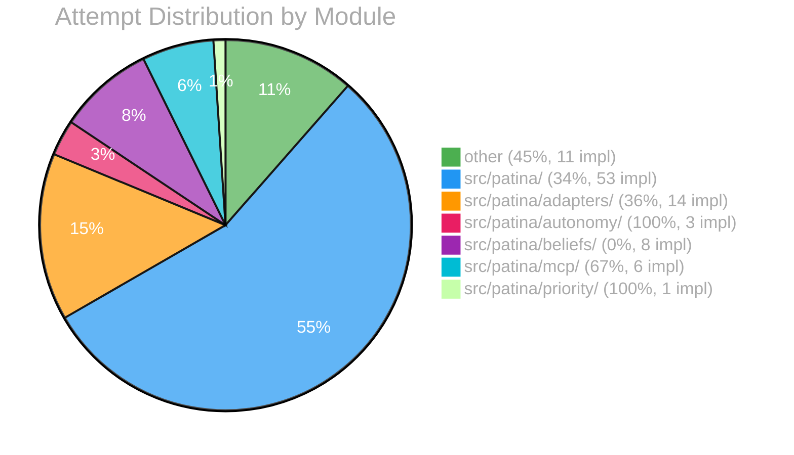

# EVAL Report

## Overall

| Metric | Value |
|--------|-------|
| First-attempt success | 76% |
| Avg cost/PR | $0.81 |
| Human edit rate | 30% |

## Auto-Merge Gate (repo-level)

| Metric | Value | Threshold |
|--------|-------|-----------|
| Success rate | 76% | >90% |
| Edit rate | 30% | <5% |
| Clean merges | 64 | ≥10 |
| **Ready?** | **No** | |

## Per-Module Breakdown

| Module | Success | Avg Cost | Impl | Auto-merge ready? |
|--------|---------|----------|------|--------------------|
| other | 45% | $0.79 | 11 | No |
| src/patina/ | 34% | $0.76 | 53 | No |
| src/patina/adapters/ | 36% | $0.39 | 14 | No |
| src/patina/autonomy/ | 100% | $1.38 | 3 | No |
| src/patina/beliefs/ | 0% | $0.00 | 8 | No |
| src/patina/mcp/ | 67% | $0.40 | 6 | No |
| src/patina/priority/ | 100% | $1.91 | 1 | No |

## Trend

| Date (UTC) | Implementations | First-attempt | Avg Cost | Human Edits |
|------|----------------|---------------|----------|-------------|
| 2026-07-20 | 14 | 0% | $0.00 | 0% |
| 2026-07-27 | 1 | 100% | $0.59 | 0% |
| 2026-08-03 | 14 | 71% | $0.80 | 21% |
| 2026-08-10 | 1 | 100% | $0.38 | 100% |
| 2026-08-24 | 9 | 87% | $0.83 | 0% |
| 2026-08-31 | 6 | 75% | $0.86 | 0% |
| 2026-09-07 | 2 | 100% | $0.64 | 50% |
| 2026-09-19 | 1 | 100% | $0.15 | 0% |
| 2026-09-20 | 0 | 0% | $0.77 | — |
| 2026-09-21 | 0 | — | — | — |
| 2026-09-22 | 0 | — | — | — |
| 2026-09-23 | 0 | — | — | — |
| 2026-09-24 | 0 | — | — | — |
| 2026-09-25 | 0 | — | — | — |
| 2026-09-26 | 0 | — | — | — |
| 2026-09-28 | 8 | 70% | $2.04 | 0% |
| 2026-09-29 | 1 | 100% | $0.18 | 0% |
| 2026-09-30 | 0 | — | — | — |
| 2026-10-01 | 0 | — | — | — |
| 2026-10-03 | 11 | 92% | $0.18 | 0% |
| 2026-10-04 | 10 | 0% | $0.82 | 0% |
| 2026-10-05 | 2 | 0% | $0.00 | 0% |
| 2026-10-06 | 3 | 0% | $0.81 | 0% |
| 2026-10-07 | 0 | — | — | — |
| 2026-10-08 | 2 | — | — | — |
| 2026-10-09 | 9 | — | — | — |

```mermaid
xychart-beta
    title "First-Attempt Success Rate (2026)"
    x-axis ["7/20", "7/27", "8/3", "8/10", "8/24", "8/31", "9/7", "9/20", "9/26", "10/4", "10/9"]
    y-axis "Success %" 0 --> 100
    line [0, 100, 71, 100, 87, 75, 100, 67, 0, 74, 0]
```

```mermaid
xychart-beta
    title "Avg Cost/PR (2026)"
    x-axis ["7/20", "7/27", "8/3", "8/10", "8/24", "8/31", "9/7", "9/20", "9/26", "10/4", "10/9"]
    y-axis "Cost ($)" 0 --> 1
    line [0.00, 0.59, 0.80, 0.38, 0.83, 0.86, 0.64, 0.36, 0.00, 0.94, 0.35]
```

```mermaid
%%{init: {'theme': 'base', 'themeVariables': {'pie1': '#4CAF50', 'pie2': '#2196F3', 'pie3': '#FF9800', 'pie4': '#E91E63', 'pie5': '#9C27B0', 'pie6': '#00BCD4', 'pieTitleTextColor': '#aaa', 'pieLegendTextColor': '#aaa', 'pieSectionTextColor': '#fff'}}}%%
pie title Attempt Distribution by Module
    "other (45%, 11 impl)" : 11
    "src/patina/ (34%, 53 impl)" : 53
    "src/patina/adapters/ (36%, 14 impl)" : 14
    "src/patina/autonomy/ (100%, 3 impl)" : 3
    "src/patina/beliefs/ (0%, 8 impl)" : 8
    "src/patina/mcp/ (67%, 6 impl)" : 6
    "src/patina/priority/ (100%, 1 impl)" : 1
```
