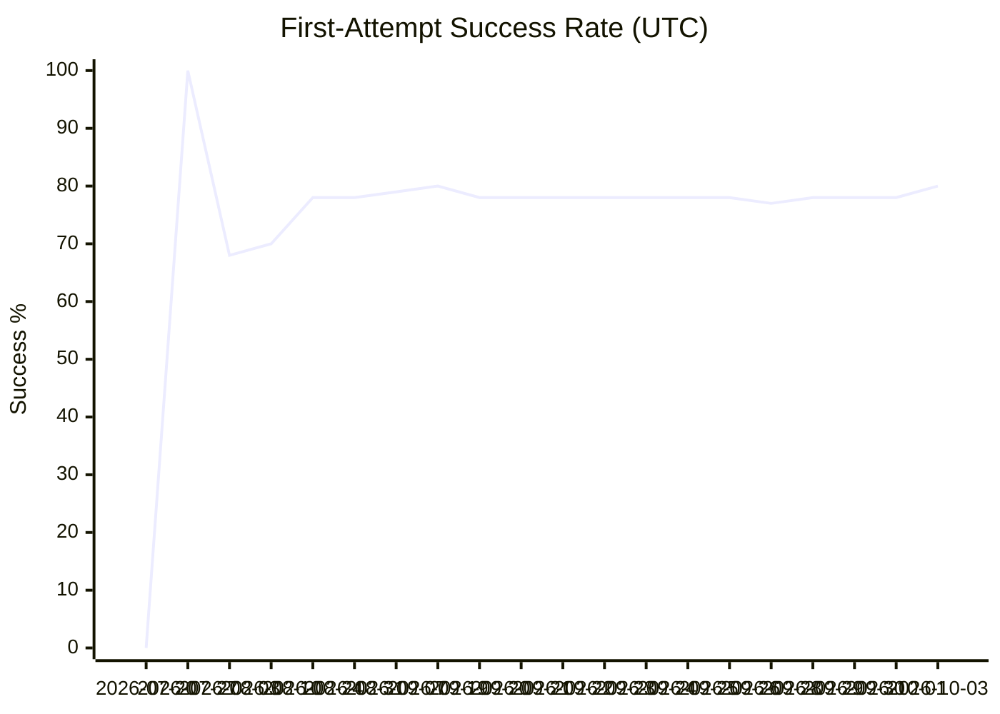
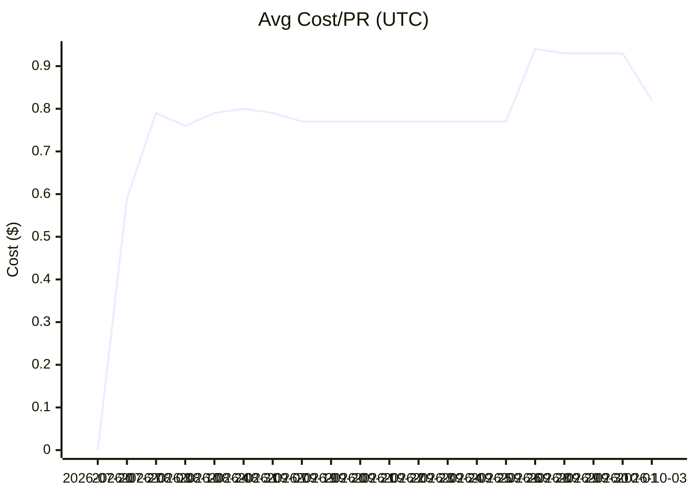
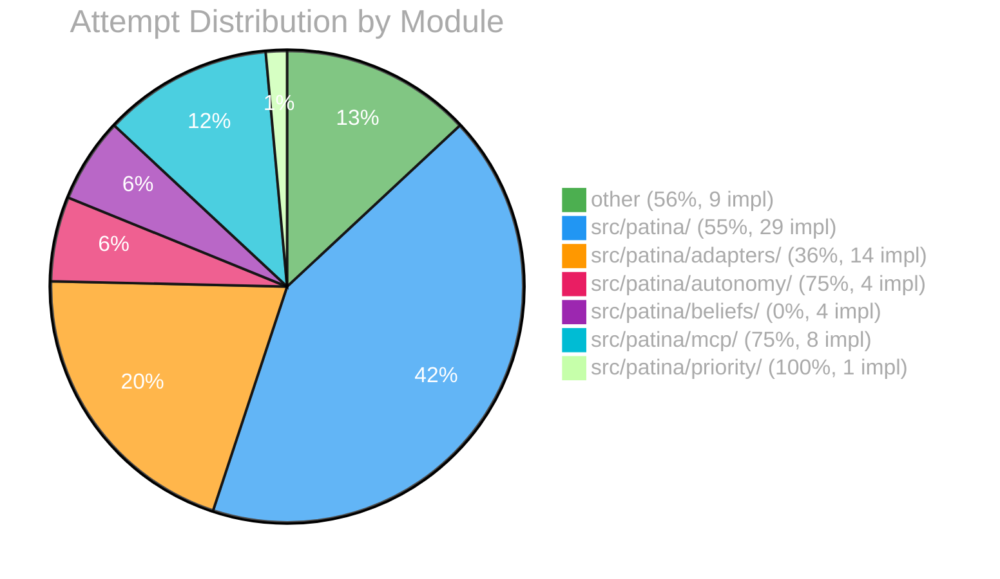

# EVAL Report

## Overall

| Metric | Value |
|--------|-------|
| First-attempt success | 80% |
| Avg cost/PR | $0.82 |
| Human edit rate | 7% |

## Auto-Merge Gate (repo-level)

| Metric | Value | Threshold |
|--------|-------|-----------|
| Success rate | 80% | >90% |
| Edit rate | 7% | <5% |
| Clean merges | 62 | ≥10 |
| **Ready?** | **No** | |

## Per-Module Breakdown

| Module | Success | Avg Cost | Impl | Auto-merge ready? |
|--------|---------|----------|------|--------------------|
| other | 56% | $0.97 | 9 | No |
| src/patina/ | 55% | $1.23 | 29 | No |
| src/patina/adapters/ | 36% | $0.39 | 14 | No |
| src/patina/autonomy/ | 75% | $1.68 | 4 | No |
| src/patina/beliefs/ | 0% | $0.00 | 4 | No |
| src/patina/mcp/ | 75% | $0.54 | 8 | No |
| src/patina/priority/ | 100% | $1.91 | 1 | No |

## Trend

| Date (UTC) | Implementations | First-attempt | Avg Cost | Human Edits |
|------|----------------|---------------|----------|-------------|
| 2026-07-20 | 14 | 0% | $0.00 | 0% |
| 2026-07-27 | 1 | 100% | $0.59 | 0% |
| 2026-08-03 | 14 | 71% | $0.80 | 21% |
| 2026-08-10 | 1 | 100% | $0.38 | 100% |
| 2026-08-24 | 9 | 87% | $0.83 | 0% |
| 2026-08-31 | 6 | 75% | $0.86 | 0% |
| 2026-09-07 | 2 | 100% | $0.64 | 50% |
| 2026-09-19 | 1 | 100% | $0.15 | 0% |
| 2026-09-20 | 0 | 0% | $0.77 | — |
| 2026-09-21 | 0 | — | — | — |
| 2026-09-22 | 0 | — | — | — |
| 2026-09-23 | 0 | — | — | — |
| 2026-09-24 | 0 | — | — | — |
| 2026-09-25 | 0 | — | — | — |
| 2026-09-26 | 0 | — | — | — |
| 2026-09-28 | 8 | 70% | $2.04 | 0% |
| 2026-09-29 | 1 | 100% | $0.18 | 0% |
| 2026-09-30 | 0 | — | — | — |
| 2026-10-01 | 0 | — | — | — |
| 2026-10-03 | 11 | 92% | $0.18 | 0% |

```mermaid
xychart-beta
    title "First-Attempt Success Rate (UTC)"
    x-axis ["2026-07-20", "2026-07-27", "2026-08-03", "2026-08-10", "2026-08-24", "2026-08-31", "2026-09-07", "2026-09-19", "2026-09-20", "2026-09-21", "2026-09-22", "2026-09-23", "2026-09-24", "2026-09-25", "2026-09-26", "2026-09-28", "2026-09-29", "2026-09-30", "2026-10-01", "2026-10-03"]
    y-axis "Success %" 0 --> 100
    line [0, 100, 68, 70, 78, 78, 79, 80, 78, 78, 78, 78, 78, 78, 78, 77, 78, 78, 78, 80]
```

```mermaid
xychart-beta
    title "Avg Cost/PR (UTC)"
    x-axis ["2026-07-20", "2026-07-27", "2026-08-03", "2026-08-10", "2026-08-24", "2026-08-31", "2026-09-07", "2026-09-19", "2026-09-20", "2026-09-21", "2026-09-22", "2026-09-23", "2026-09-24", "2026-09-25", "2026-09-26", "2026-09-28", "2026-09-29", "2026-09-30", "2026-10-01", "2026-10-03"]
    y-axis "Cost ($)"
    line [0.00, 0.59, 0.79, 0.76, 0.79, 0.80, 0.79, 0.77, 0.77, 0.77, 0.77, 0.77, 0.77, 0.77, 0.77, 0.94, 0.93, 0.93, 0.93, 0.82]
```

```mermaid
%%{init: {'theme': 'base', 'themeVariables': {'pie1': '#4CAF50', 'pie2': '#2196F3', 'pie3': '#FF9800', 'pie4': '#E91E63', 'pie5': '#9C27B0', 'pie6': '#00BCD4', 'pieTitleTextColor': '#aaa', 'pieLegendTextColor': '#aaa', 'pieSectionTextColor': '#fff'}}}%%
pie title Attempt Distribution by Module
    "other (56%, 9 impl)" : 9
    "src/patina/ (55%, 29 impl)" : 29
    "src/patina/adapters/ (36%, 14 impl)" : 14
    "src/patina/autonomy/ (75%, 4 impl)" : 4
    "src/patina/beliefs/ (0%, 4 impl)" : 4
    "src/patina/mcp/ (75%, 8 impl)" : 8
    "src/patina/priority/ (100%, 1 impl)" : 1
```
