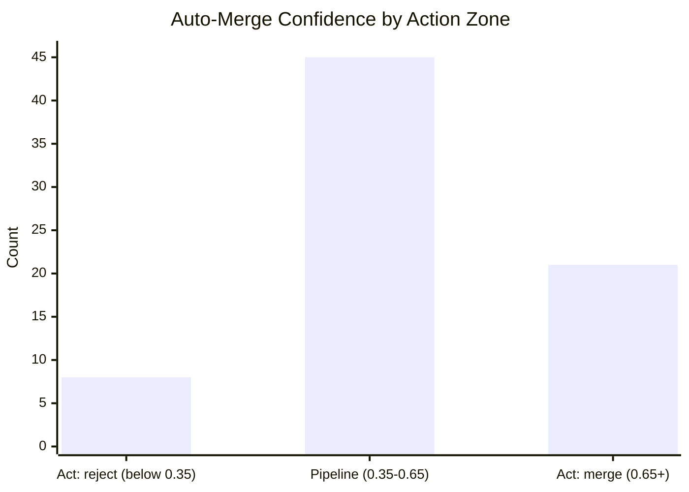
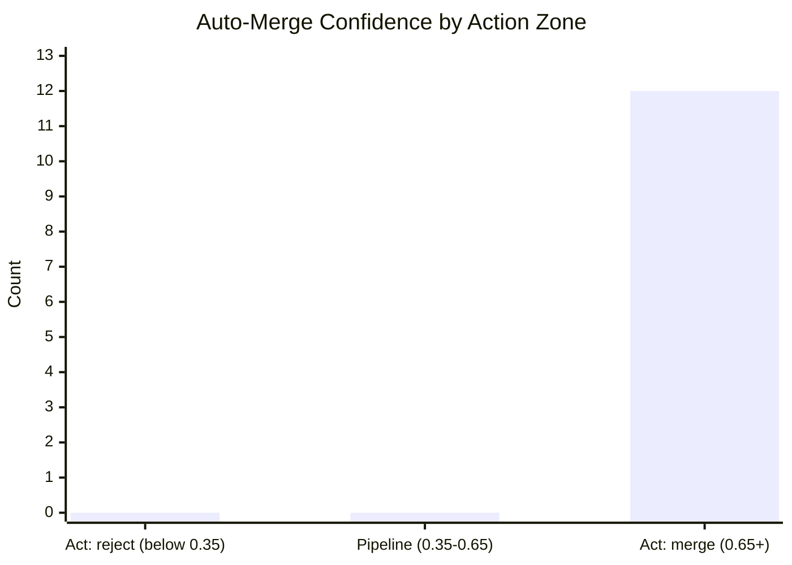

# JEV Report

## Counts

- **Total entries:** 140
- **Live entries:** 113
- **Backfilled entries:** 27
- **Date range:** 2026-07-03 to 2026-10-06

## Triage Agreement

- **Agreed:** 3 of 19
- **Disagreed:** 0 of 19
- **Uncertain (fell back):** 16 of 19
- **When confident, agreed:** 3 of 3 (100.0%)

### Weekly Trends

| Week | Agreed | Uncertain | n |
|------|--------|-----------|---|
| 9/28 | 2 | 9 | 11 |
| 10/5 | 1 | 7 | 8 |

## Auto-Merge Agreement

- **Mean confidence:** 0.569 (n=74)
- **Median confidence:** 0.560 (n=74)
- **Agreement with incumbent decision:** 100.0% (3/3)

## Backfill

### Backfill Auto-Merge Agreement

- **Mean confidence:** 0.790 (n=12)
- **Median confidence:** 0.805 (n=12)
- **Agreement with incumbent decision:** 0.0% (0/0)

