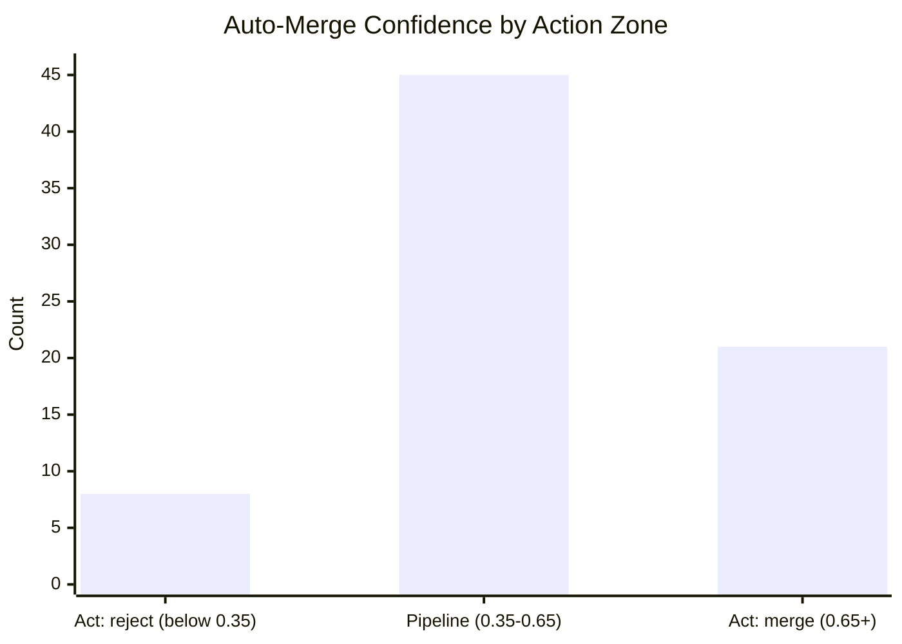
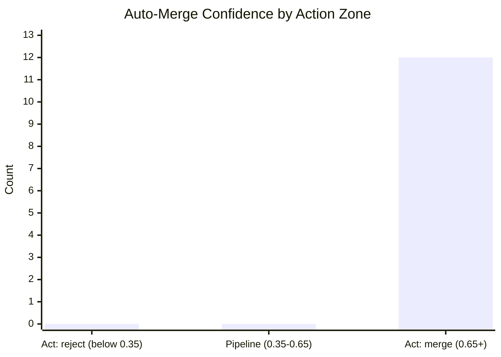

# JEV Report

**Verdict:** too few decisions to judge (n=19)

## Legend

- **Incumbent decision:** the human/pipeline decision that was actually used
- **Fell back:** Jev returned an uncertain result and deferred to the incumbent
- **Pipeline (0.35–0.65):** confidence too close to call; Jev defers to the incumbent
- **Backfilled:** a decision reconstructed from historical data, not made live

## Counts

- **Total entries:** 140
- **Live entries:** 113
- **Backfilled entries:** 27
- **Date range:** 2026-07-03 to 2026-10-06

## Triage Agreement

- **Agreed:** 3 of 19
- **Disagreed:** 0 of 19
- **Uncertain (fell back):** 16 of 19
- **When confident, agreed:** 3 of 3 (too few to judge)

### Weekly Trends

| Week | Agreed | Disagreed | Uncertain | n |
|------|--------|-----------|-----------|---|
| 9/28 | 2 | 0 | 9 | 11 |
| 10/5 | 1 | 0 | 7 | 8 |

## Auto-Merge Agreement

- **Mean confidence:** 0.569 (n=74)
- **Median confidence:** 0.560 (n=74)
- **Agreement with incumbent decision:** 100.0% (3/3)

### Per-Zone Agreement

| Zone | Agreed | Total | Agreement |
|------|--------|-------|-----------|
| Act: reject (below 0.35) | — | 0 | no outcomes yet |
| Pipeline (0.35-0.65) | 3 | 3 | 100% |
| Act: merge (0.65+) | — | 0 | no outcomes yet |

## Backfill

### Backfill Auto-Merge Agreement

- **Mean confidence:** 0.790 (n=12)
- **Median confidence:** 0.805 (n=12)
- **Agreement with incumbent decision:** no outcomes yet

---

*Generated at 2026-10-10 21:42 UTC*