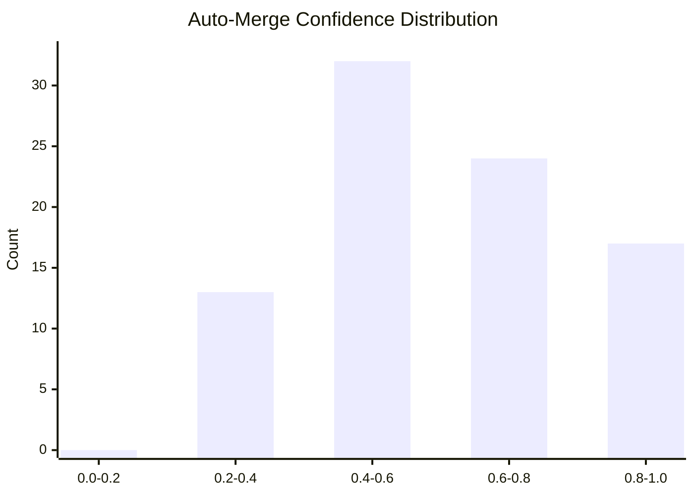
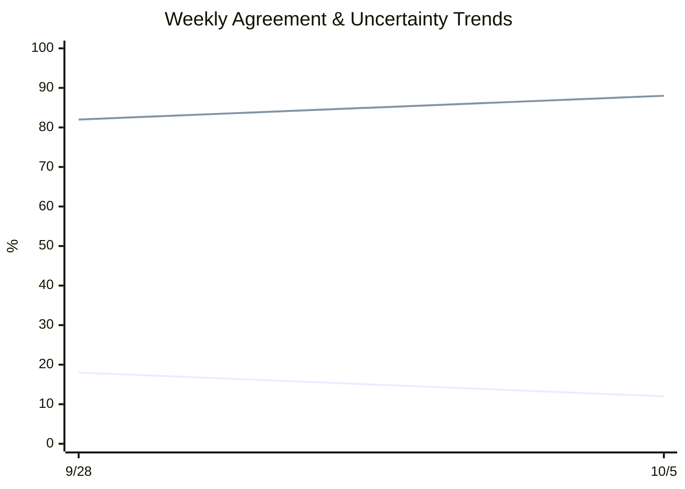

# JEV Report

## Counts

- **Total entries:** 140
- **Live entries:** 113
- **Backfilled entries:** 27
- **Date range:** 2026-07-03 to 2026-10-06

## Triage Calibration

- **Agreement rate:** 15.8%
- **Uncertainty rate:** 84.2%

## Auto-Merge Calibration

- **Mean confidence:** 0.600
- **Median confidence:** 0.580
- **Agreement with outcome:** 100.0%

